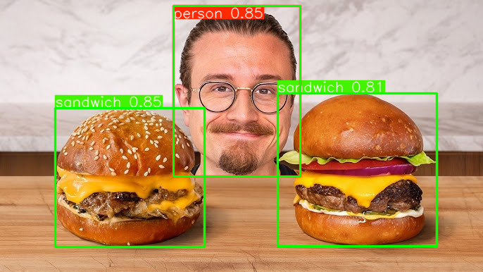
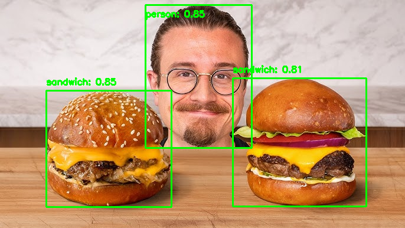

# YOLOv5 Object Detection Project

## Project Title

YOLOv5 Object Detection using Google Colab

## Short Description

This project performs object detection on uploaded images using YOLOv5 models in Google Colab. Two implementations were included: YOLOv5s for basic object detection with bounding boxes, and YOLOv5x for improved detection performance with object labels and confidence scores.

## Tools and Libraries Used

* Python 3
* Google Colab
* PyTorch
* YOLOv5 (Ultralytics)
* OpenCV
* NumPy

## How to Run the Code

1. Open `code.ipynb` in Google Colab.
2. Install the required package:

   ```bash
   pip install ultralytics
   ```
3. Run all cells.
4. Upload an image when prompted.
5. View the detection results and saved output images.

## Input Image Description

The input is an image uploaded by the user. Images may contain common objects such as people, cars, chairs, and other objects from the COCO dataset.

## Output Result Explanation

* **Method 1 (YOLOv5s):** Detects objects and saves an image with bounding boxes (`output_result1.png`).
* **Method 2 (YOLOv5x):** Detects objects, displays object names with confidence scores, and saves the result image (`output_result2.png`).

Example output:

```text
person: 0.92
car: 0.88
chair: 0.74
```

## Code Modifications

* Changed the YOLOv5 model from **YOLOv5s** to **YOLOv5x**.
* Added functionality to print **detected object names and confidence scores**.

## Screenshot / Output Image

Add the generated output images here:

```markdown


```

## License

This project is licensed under the MIT License. See the `LICENSE` file for details.
